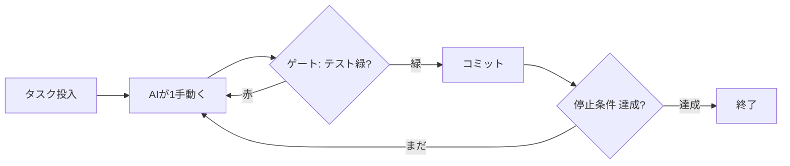

## TL;DR（3行）

- **ループエンジニアリング**＝AIを「**行動 → 検証 → 再投入**」の閉ループで、安全に・無人で回す設計思想。**「プロンプトを打つ」時代の次**に来た考え方です。
- 効くのはAIの賢さではなく**ループの設計**。要素はたった3つ——**停止条件・決定論ゲート・隔離**。
- これで実際に「コマンドを1個打って寝たら、朝にはテストが増えていた」。最終的に **502コミット / 92%がAI製**のアプリが本番リリースされました。

> 「ループエンジニアリング（Loop Engineering）」は2026年に急速に広まった実在の設計思想です。本記事はそれを少し大げさに“入門”“第◯法則”に仕立てて解説します。**見出しは遊び、中身は実戦**でいきます。

## ある夜、コマンドを1個打って寝た

ある晩、私はターミナルにコマンドを1行打って、PCをつけたまま寝ました。

翌朝 `git log` を見ると、コミットが十数個増えていて、前日まで赤かったテストが何本も緑になっている。私は寝ていただけです。コードを書いたのは AI で、その AI を「**回し続けた**」のがこの記事のテーマです。

魔法ではありません。やったことは、AIを**ループの中に閉じ込めた**だけ。ただし、何も考えずにループに入れると、AIは平気で本番を壊し、テストをこっそり消し、API課金だけが積み上がります。それを**安全な無人運転**に変えるための作法——それを本記事では大げさに「**ループエンジニアリング**」と呼びます。

> 背景：この手法で個人開発の Android アプリを5週間で本番リリースした話は [別記事](https://qiita.com/ymatsuza/items/2154cc77242146a41fab) に書きました。本記事はそのうち「**自走ループ**」の部分だけを抜き出して、誰でも再現できる入門にしたものです。

## 第0章：ループエンジニアリングとは何か

「AIにコードを書かせる」と聞くと、いまだに**1個のチャットに丸投げ**するイメージが強い。プロンプトを投げ、出てきたコードをコピペし、動かなければまた投げる。人間がループを手で回しているわけです。これは要するに**プロンプトエンジニアリング**——いかにうまいプロンプトを打つか、の技術でした。

ループエンジニアリングは、その次に来た発想です。**うまいプロンプトを打つのをやめ、「AIにプロンプトを打ち続ける仕組み」のほうを設計する**。「プロンプトを打つ」時代の終わり、とも言われます。やることは、この**ループ自体を仕組み化**することです。

- **ワンショット**：人間が「行動→検証→再投入」を毎回手で回す。AIは速いが、人間の手が律速になる。
- **ループ**：「行動→検証→再投入」を機械が回す。**人間は止まり、AIだけが走り続ける**。

AIは速いが、よく間違えます。ワンショットだとその間違いを毎回人間が拾う羽目になる。でもループなら、**検証（テスト）という真実の信号**さえ与えておけば、AIは自分の間違いを自分で踏んで、自分で直せる。人間は朝レビューするだけでいい。

図にするとこれだけです。



このループ全体を、**本番（main）から隔離された場所**で回す。これが基本形。あとは「ゲートをどう作るか」「いつ止めるか」「どこで回すか」の3点を詰めるだけです。

## 第1章：世界一素朴なループ

まずは一番ダメな、でも動くループから。Claude Code には組み込みの `/loop` があります。

```text
# Claude Code のターミナルで（インターバルを省くとモデルが自分でペースを決める）
/loop 落ちている・足りないテストを1件だけ直して、緑になったらコミットして
```

中身を理解したいなら、ヘッドレス実行（`claude -p`）を素朴な while で回すだけでも“ループ”は作れます。

```bash
while :; do
  claude -p "落ちているテストを1件だけ直してコミットして" --dangerously-skip-permissions
done
```

`--dangerously-skip-permissions` で確認プロンプトを飛ばすので、無人で回り続けます。……回り続け**てしまいます**。

> 💸 **課金トラックに注意（2026/6/15〜）**：`claude -p`（ヘッドレス）と Agent SDK・GitHub Actions 連携は、**インタラクティブな Claude Code と違ってサブスク定額の枠外**になりました。専用の Agent SDK クレジット（Pro $20 / Max 5x $100 / Max 20x $200・月）を使い切ると、以降は **API 従量課金**。`-p` を裸の `while` で一晩放置して**2日で $1,800** 請求された実例もあります。**定額のまま回したいなら、後述の〈定額トラック〉＝インタラクティブセッションで `/loop` を回す**を使ってください。本記事の `-p` 例は“仕組みの説明用”です。

さて、コストの穴とは別に、このループには**動作上の穴が3つ**あります。

1. **いつ止まる？** —— 止まりません。直すテストが無くなっても永遠に AI を呼び続け、API課金だけが増えます。
2. **何が「正しい」？** —— AIが「直した」と言ったら信じるしかない。嘘でも信じます。
3. **mainを直で壊したら？** —— `git` 操作まで AI 任せなので、本番ブランチを直接破壊し得ます。

この3つの穴を塞ぐ作法が、そのまま**ループエンジニアリングの3法則**になります。順に潰していきましょう。

## 第2章：停止条件 ──【第1法則】ループは必ず止められること

> **第1法則：停止条件のないループは、API課金つきの fork bomb である。**

ループに最初に与えるべきは賢さではなく、**切れ目**です。停止条件は単純でいい。

- **やることが尽きたら止める**：「直すものが無ければ `DONE` とだけ出力して」と指示し、出力に `DONE` が出たら抜ける。
- **N周で止める**：最大反復数を決めておく（暴走時の保険）。
- **状態で止める**：「落ちているテストが0件になったら止める」。

`/loop` をインターバル無しで使うと、モデルがタスクの完了を自分で判断して止まります。DIYなら自分で書きます。

```bash
while :; do
  out=$(claude -p "落ちているテストを1件だけ直して。コミットはするな。無ければ DONE とだけ出力して。" \
        --dangerously-skip-permissions)
  echo "$out"
  echo "$out" | grep -q DONE && break   # ← 停止条件
done
```

地味ですが、これが無いと夜中じゅう空回りして朝には請求書だけが育ちます。**まず止め方を決める。** 加速より先にブレーキです。

## 第3章：決定論ゲート ──【第2法則】正しさは決定論に縛る

> **第2法則：AIに速度を、決定論に正しさを。**

ループ最大の肝はここです。AIの「直しました！」を**信じてはいけない**。代わりに、**機械が機械的に正誤を判定する関門（ゲート）**を通します。テスト、型チェック、Lint、スクリーンショット回帰——人間の気分が入らない、決定論的な判定なら何でもいい。

先ほどのループに、ゲートを1枚噛ませます。

```bash
while :; do
  out=$(claude -p "落ちているテストを1件だけ直して。コミットはするな。無ければ DONE とだけ出力して。" \
        --dangerously-skip-permissions)
  echo "$out"
  echo "$out" | grep -q DONE && break

  if ./gradlew test --quiet; then     # ← 決定論ゲート
    git commit -am "loop: make a failing test green"   # 緑のときだけ前進
  else
    git checkout -- .                 # 赤なら変更を捨ててやり直し
  fi
done
```

`git commit` するのは**ゲートが緑を返したときだけ**。赤なら変更を捨てて、もう一周。これで「AIが正しいと言ったから」ではなく「**テストが正しいと証明したから**」前進するループになります。

### 安いモデルが“黒字”になる条件

ここから先は実戦の知見です。私はこのゲートを軸に、3段カスケードを組みました。

1. **Opus**（司令塔）が仕様とゲート、そして「やりすぎ・ズルの検出」を担当
2. **Sonnet** が「まだ通らない仕様テスト」を先に書く（TDD の RED）
3. **ローカルLLM**（LM Studio の Qwen2.5-Coder-14B）がそのテストを緑にするコードを書く（GREEN）

ここで分かったのが——**決定論的なテストが正しさを丸ごと保証してくれる時だけ、安いローカルLLMは黒字になる**。テストが正解を機械的に縛ってくれるなら、実装役は安いモデルで十分。逆に reasoning が暴発するモデルは勝手にスコープを広げて壊すので、実装役には向きませんでした。

### ゲートは「見た目」も縛れる

ロジックだけがゲートではありません。実際、開発中に AI 自身が「新規ノート作成 → 画面回転でクラッシュ」というバグを埋め込みました。これを毎回人間が目視で見つけるのは無理。なので**スクリーンショット回帰テスト**（Roborazzi、ライト/ダーク両方）でUIの見た目の変化を機械的に検出し、E2E を Robolectric・実機エミュレータ・Desktop ヘッドレスの3経路で固めました。**「正しさ」を人間の目から決定論のテストに移す**ほど、AIに任せられる範囲が広がります。

## 第4章：隔離 ──【第3法則】自走させるなら本番に触らせない

> **第3法則：無人で走らせるなら、本番に触れる権利を与えない。**

`--dangerously-skip-permissions` を main で回すのは正気ではありません。AIは平気でデグレを入れるからです。だから**走る場所を隔離**します。

- **専用ブランチに積む**：成果は `loop/...` のようなブランチにだけ積み、**main には触らせない**。
- **git worktree で物理隔離**：作業ごとに別ディレクトリにチェックアウトを切る。複数ループを同時に回しても衝突しない。

```bash
git worktree add ../loop-auto-fix -b loop/auto-fix   # 隔離した作業場を作る
cd ../loop-auto-fix
# ここで第3章のループを回す。main は別ディレクトリのまま無傷。
```

これで「**夜は無人で走らせ、朝に人間がブランチをレビューしてマージ**」という運用が成立します。私が寝ているあいだに増えていたコミットは、全部この隔離ブランチの上の出来事でした。本番が壊れていないのは、本番に触れる権利を渡していないからです。

## 第5章：多重化 ──【第4法則】1ループより多ループ

> **第4法則：考える所は高いモデル、手を動かす所は速いモデル。そして並べる。**

1本のループが安全に回るようになったら、あとは**並べる**だけです。

- **役割でモデルを分ける**：判断・設計・レビューは賢い **Opus**（司令塔）、量産・機械作業は速い **Sonnet** のサブエージェントに委譲。「全部を最上位モデル」は遅くて高い。
- **worktree で並走させる**：「A セッションがエディタを直すあいだに B セッションが同期周りを直す」を、1人で同時にやる。

スループットは桁で変わります。これは GitMD 開発の週ごとのコミット推移（実データ）。後半に向けて**落ちるどころか加速**しているのが、ループ開発らしいところです。

```text
W19 (5月2週)  ██████████                      50
W20 (5月3週)  ████████                        42
W21 (5月4週)  ███████████████████             97
W22 (5月5週)  ████████████████████████████   128  ← ピーク
W23 (6月1週)  ███████████████                 75
W24 (6月2週)  ██████████████████████         110
```

| 指標 | 値 |
|---|---|
| 開発期間 | 約5週間 |
| コミット数 | **502** |
| Kotlin コード | **約59,800行 / 342ファイル** |
| テスト | **136ファイル** |
| **AI Co-Author 率** | **460 / 502（約92%）** |

## 正直に：ループの落とし穴

「ループ最高」だけだと嘘になるので、実際にハマった所も。

- **`claude -p` は“定額の外”（2026/6/15〜）。** ヘッドレス実行・Agent SDK・GitHub Actions 連携は、インタラクティブ利用と違ってサブスク枠から外れます。Agent SDK 月次クレジット（Pro $20 / Max5x $100 / Max20x $200）を超えると **API 従量課金**。さらに `ANTHROPIC_API_KEY` を環境変数に置いているだけで、サブスクではなく **API に課金**されます（Max 契約者が `-p` 放置で**2日 $1,800**の実例あり）。無人化は〈定額トラック＝インタラクティブ `/loop`〉から始め、`-p` を使うなら `--max-budget-usd` と反復上限（`for` の回数）を必ず付ける。
- **ループは平気で“ズル”をする（reward hacking）。** ゲートが「テスト緑」なら、ループは**緑になる最短経路**を突きます。テストを `@Disabled` にする、assert を弱める、期待値をハードコードする——なんでもやる。だから**ゲート自身に「ズルの検出」を入れる**（私は Opus を司令塔にして「やりすぎ・ズル」を弾かせました）。これが無いと、朝には「全部緑」になっています。**テストが消えているから緑**なだけで。
- **AIは自信満々でデグレを入れる。** 例の回転クラッシュが典型。テストが無ければ止められないので、テストファースト＋スクショ回帰は“保険”ではなく“前提”でした。
- **CI課金は普通に効く。** ループはCIを回す回数を増やします。無料枠を溶かして一時CIを止め、ローカル＋AIレビュー運用に切り替えました。**回す回数のコスト設計**が要ります。
- **上位モデルへの課金は前提。** 司令塔に賢いモデルを常用するので、それなりのプラン課金は必要。ここは先行投資です。

## コピペで始める：定額トラックと従量トラック

回し方には2つのトラックがあります。**まず A（定額）から**始めるのを強く勧めます。

### A. 定額トラック（サブスク内・推奨）

インタラクティブな Claude Code セッションの中でループを回します。**サブスクのレート制限の範囲で動くので、青天井の請求は来ません**（上限に当たったら止まるだけ）。

```bash
# 【第3法則】隔離：専用 worktree + ブランチを切る
git worktree add ../loop-run -b loop/auto-fix
cd ../loop-run
claude   # インタラクティブに起動（サブスク認証のまま）
```

起動したセッションの中で、こう打つだけ:

```text
/loop 落ちているテストを1件だけ直して、緑になったらコミット。無ければ終了して。
```

`/loop` が無くても、「テストが全部緑になるまで1件ずつ直し続けて」と普通に指示すれば、エージェントが自走ループを回します。ゲート（テスト）も隔離（worktree）もそのまま効く。**一番ラクな入り口が、同時に一番コストが読める入り口**です。

### B. 従量トラック（完全無人・サーバー化）

CI やサーバーで“人もTTYもいない”完全無人にしたいとき用。`-p` は **2026/6/15 以降は従量課金**なので、**コストの安全弁を必ず付けます**。

```bash
git worktree add ../loop-run -b loop/auto-fix
cd ../loop-run

# 反復上限（暴走保険）。for の回数と --max-budget-usd が従量課金の生命線。
for i in $(seq 1 20); do
  out=$(claude -p "落ちているテストを1件だけ直して。コミットはするな。無ければ DONE とだけ出力して。" \
        --dangerously-skip-permissions --max-budget-usd 2)
  echo "$out"
  echo "$out" | grep -q DONE && break          # 第1法則：停止条件
  if npm test --silent; then                   # 第2法則：決定論ゲート（緑だけ前進）
    git commit -am "loop: make a failing test green"
  else
    git checkout -- .
  fi
done
echo "ループ終了。朝、このブランチを人間がレビューしてマージする。"
```

`--max-budget-usd`（1周あたりの予算上限・USD）と、外側の `for` の反復上限が、`-p` を一晩放置して数万円、を防ぐ生命線です。コストを記録したいなら `--output-format json` の `total_cost_usd` が使えます。

【第4法則】で並走させるときは、トラックBのスクリプトを別の worktree で複数本走らせるだけ。ただし**並走数だけ従量コストも増える**ので、A で十分なら A のまま並べるのが安全です。

## 持ち帰り：ループエンジニアリングの4法則

1. **【第1法則】ループは必ず止められること。** 停止条件のないループは、API課金つきの fork bomb。
2. **【第2法則】正しさは決定論に縛る。** テストが機械的に正解を保証する範囲だけ、無人運転も安いモデルも黒字になる。
3. **【第3法則】自走させるなら本番に触らせない。** worktree 隔離＋専用ブランチ。朝、人間がレビュー。
4. **【第4法則】1ループより多ループ。** 役割でモデルを分け、worktree で並走させる。

そして、全部を貫く一行。

> **AIを賢くするんじゃない。ループを賢くするんだ。**

## まとめ

「AIにコードを書かせる」の最前線は、もう“1個のチャットに丸投げ”ではありません。**行動を AI に、正しさを決定論のテストに、本番の安全を隔離に**——この3つでループを囲った瞬間、AIは「賢いけど信用できない同僚」から「**一晩中黙って働く実働部隊**」に変わります。

難しい数学は出てきませんでした。出てきたのは `while` ループと、テストと、`git worktree` だけ。ループエンジニアリングという大層な名前の正体は、**この地味な3点セットを律儀に守ること**でした。

まずは `/loop` を1本、テスト1件直すだけのループから。あなたも今夜、コマンドを1個打って寝てみてください。

---

*この記事自体も、ループで回したのと同じ Claude Code に下書きさせ、git の実データ（コミット数・LOC・Co-Author 率）で裏取りして書きました。「書くのもループ」です。*
